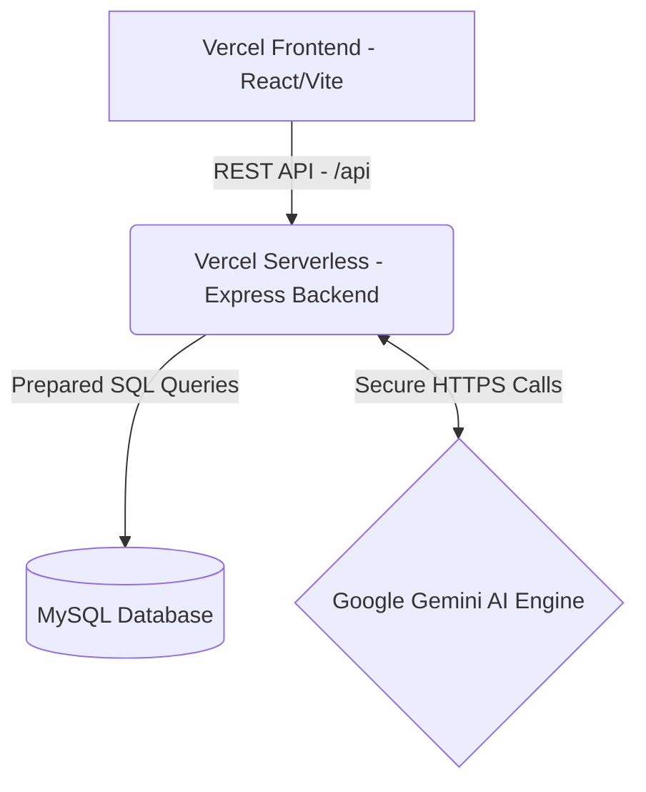

# ⚽ StadiumAI - FIFA World Cup 2026

    

StadiumAI is an award-winning, GenAI-powered Stadium Operations & Fan Experience Platform built specifically for the **FIFA World Cup 2026** at MetLife Stadium. 

Designed with a premium, immersive **PlayStation 5 & Apple VisionOS-inspired theme**, it runs completely in the cloud with zero hosting costs, utilizing **Vercel Serverless Functions** for the Node.js Express backend and static hosting for the React Vite frontend.

---

## 🏆 Key Features

### 🏃‍♂️ Fan Portal Experience
*   **Tactical Night Grid Backdrop**: Cinematic, interactive background with mouse-tracking ambient lights.
*   **AI Chat Assistant**: Ask FAQs, request wheelchair routing, or translate match briefings (e.g., to Bengali) powered by Gemini.
*   **Corridor Gate flow**: Staggered cards tracking wait times at MetLife gates.
*   **Telemetry Transit Hub**: Live shuttle/metro timelines with animated ETA progress bars.

### 👔 Organizer Mission Control
*   **Operations dashboard**: Real-time stats, incident logs, and animated charts.
*   **AI Crowd Forecasting**: Generates 90-minute bottleneck predictions using Gemini.
*   **Multilingual Broadcasting**: Instantly translate security alerts to English, Spanish, French, and Portuguese.
*   **Sustainability Center**: Track graywater recycling and waste diversion.

---

## ⚙️ Architecture & Monorepo Deploy



*   **Zero-Cost Monorepo Hosting**: Both frontend and backend compile together in a single Vercel deployment.
*   **Complete Security**: The `GEMINI_API_KEY` is fully encrypted and hidden from the browser client, passing securely only through backend serverless calls.

---

## 🛠️ Tech Stack

| Component | Technology |
| --- | --- |
| **Frontend** | React 18, Vite, Tailwind CSS, Framer Motion, Lucide Icons |
| **Backend** | Node.js, Express, Vercel Serverless Functions |
| **Database** | MySQL 8+, Aiven Cloud DB |
| **AI Engine** | Google Gemini API (gemini-2.0-flash) |

---

## 🚀 Quick Start (Local Development)

### 1. Clone & Install
```bash
git clone https://github.com/Suvranil3/fifa.git
cd fifa
npm run install:all
```

### 2. Configure Environment
Copy `.env.example` to `.env` in the root folder:
```bash
cp .env.example .env
```
Fill in your database credentials and add your `GEMINI_API_KEY`:
```
GEMINI_API_KEY=your_key_here
```

### 3. Setup MySQL Database
Import the schema and seed data:
```bash
mysql -u root -p < database/schema.sql
mysql -u root -p < database/seed.sql
```

### 4. Run Concurrently
```bash
npm run dev
```

---

## 🌐 Deploy to Vercel (100% Free, No Credit Card)

1. Import your `Suvranil3/fifa` repository on [Vercel](https://vercel.com).
2. Under **Project Settings**:
   * Set **Root Directory** to `./` (leave it blank/empty).
   * Go to **Environment Variables** and add:
     * **Key**: `GEMINI_API_KEY`
     * **Value**: `your_gemini_api_key`
3. Click **Deploy**!

---

## 🔑 Project Structure
```
stadium-ai/
├── api/             # Vercel serverless functions entry point
├── client/          # React + Vite frontend
├── server/          # Node.js + Express backend
├── database/        # MySQL Schema & Seed files
├── docs/            # API documentation log
└── vercel.json      # Monorepo deployment settings
```

---

## 📄 License
This project is licensed under the MIT License.
