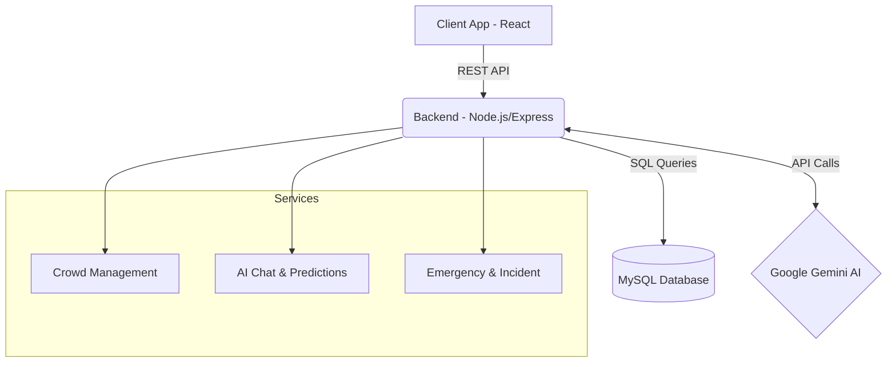

# ⚽ StadiumAI - FIFA World Cup 2026

   

StadiumAI is a GenAI Powered Stadium Operations & Fan Experience Platform designed specifically for the FIFA World Cup 2026. It leverages real-time data and Google's Gemini AI to optimize crowd management, enhance fan experience, and streamline organizer operations.

## Features

### For Fans 🏃‍♂️
- [x] Real-time crowd density maps and gate recommendations
- [x] AI-powered Chatbot for navigation and FAQs
- [x] Live food stall wait times and dietary filtering
- [x] Multi-lingual support and translation
- [x] Transport options and estimated wait times

### For Organizers 👔
- [x] AI-driven crowd predictions and bottleneck alerts
- [x] Real-time incident reporting and emergency management
- [x] Volunteer deployment and tracking
- [x] Automated announcement generation
- [x] Comprehensive reporting and analytics dashboards

## Tech Stack

| Component | Technology |
| --- | --- |
| Frontend | React, Vite, Tailwind CSS |
| Backend | Node.js, Express |
| Database | MySQL 8+ |
| AI Integration | Google Gemini API |
| Authentication | JWT, bcrypt |

## Architecture



## Prerequisites

- Node.js 18+
- MySQL 8+
- Google Gemini API Key

## Installation

1. Clone the repository
   ```bash
   git clone https://github.com/your-username/stadium-ai.git
   cd stadium-ai
   ```

2. Install dependencies for both client and server
   ```bash
   npm run install:all
   ```

3. Environment Setup
   Copy the example env file and fill in your details:
   ```bash
   cp .env.example .env
   ```
   *Edit `.env` and add your `GEMINI_API_KEY` and database credentials.*

4. Database Setup
   Import the schema and seed data into your MySQL database:
   ```bash
   mysql -u root -p < database/schema.sql
   mysql -u root -p < database/seed.sql
   ```

5. Run the Application
   ```bash
   npm run dev
   ```
   This will start both the client and server concurrently.

## Environment Variables

| Variable | Description |
| --- | --- |
| `PORT` | Backend server port (e.g., 5000) |
| `DB_*` | MySQL database credentials |
| `JWT_SECRET` | Secret key for JWT authentication |
| `GEMINI_API_KEY` | Google Gemini API key |
| `VITE_API_URL` | Base API URL for frontend |

## API Endpoints

| Resource | Endpoints |
| --- | --- |
| **Auth** | `POST /auth/register`, `POST /auth/login`, `GET /auth/profile` |
| **Crowd** | `GET /crowd`, `GET /crowd/heatmap`, `GET /crowd/predictions` |
| **Navigation** | `GET /navigation/gates`, `GET /navigation/food` |
| **AI** | `POST /ai/chat`, `POST /ai/crowd-predict` |
| **Reports** | `GET /reports`, `POST /reports/generate` |
| **Announcements**| `GET /announcements`, `POST /announcements` |
| **Volunteers** | `GET /volunteers`, `POST /volunteers/deploy` |
| **Emergency** | `GET /emergency/incidents`, `POST /emergency/incidents` |

## Project Structure

```
stadium-ai/
├── client/          # React + Vite frontend
├── server/          # Node.js + Express backend
├── database/        # SQL schema and seed files
├── docs/            # Additional documentation (API.md)
├── .env.example     # Template for environment variables
├── package.json     # Root package.json for workspace scripts
└── README.md        # Project documentation
```

## Contributing

Contributions are welcome! Please read the contributing guidelines before submitting a pull request.

## License

This project is licensed under the MIT License.
